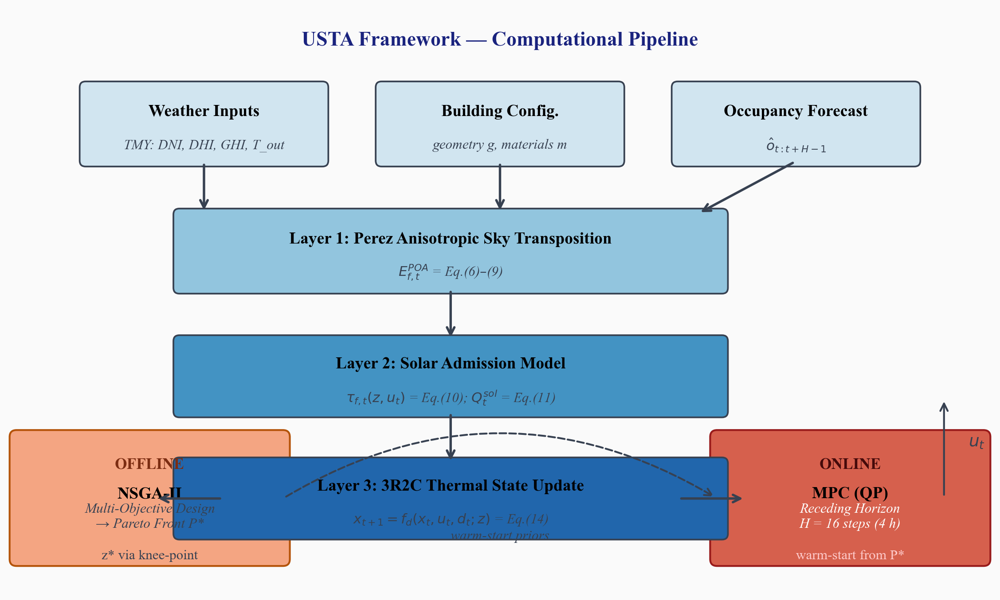
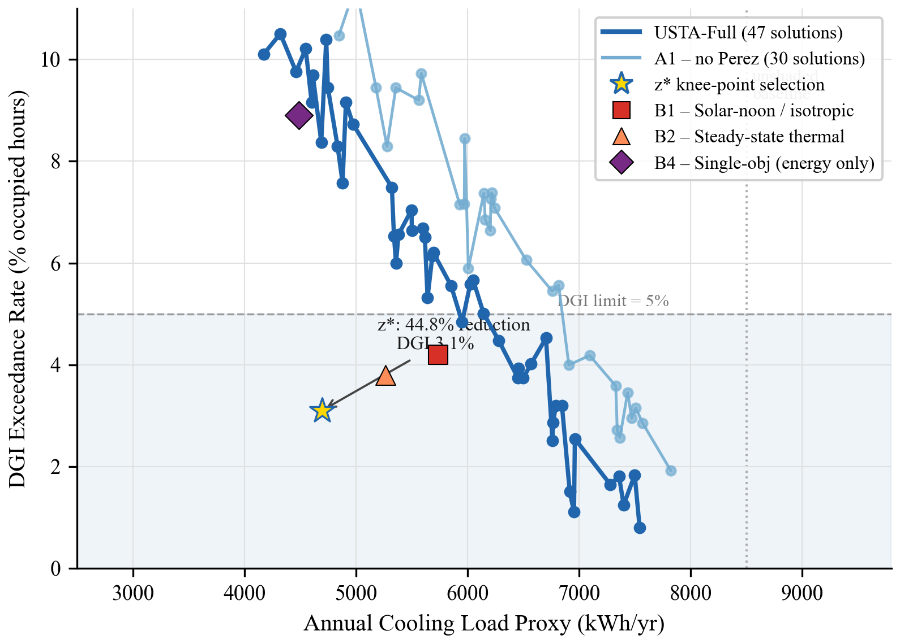
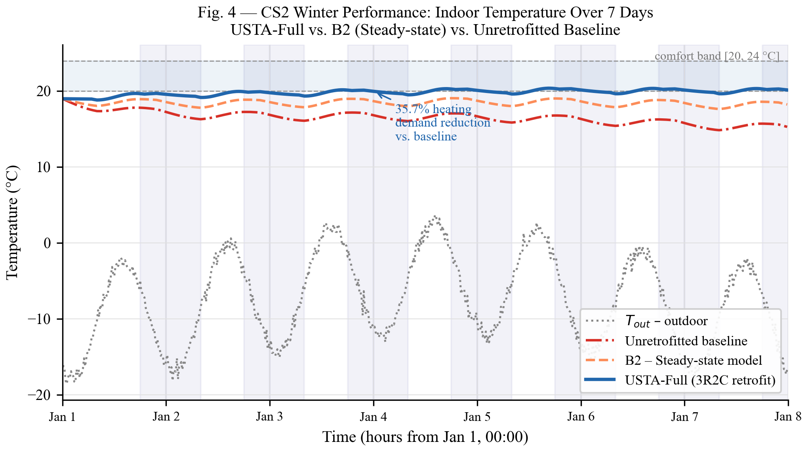
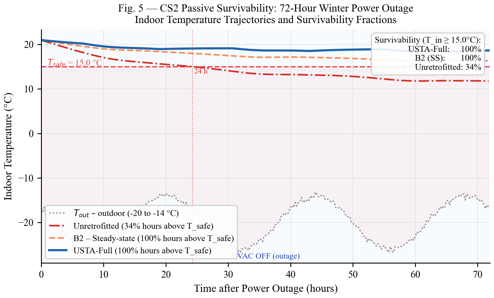
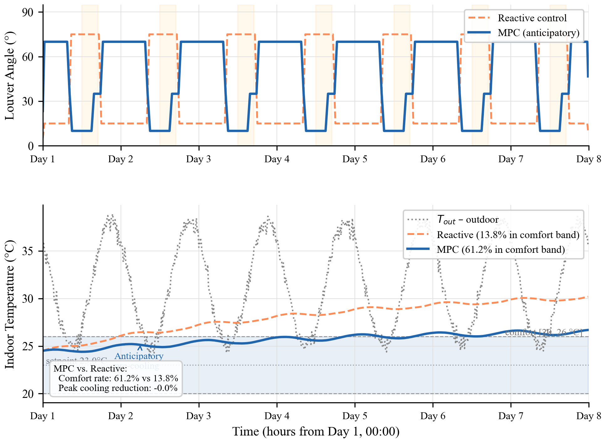
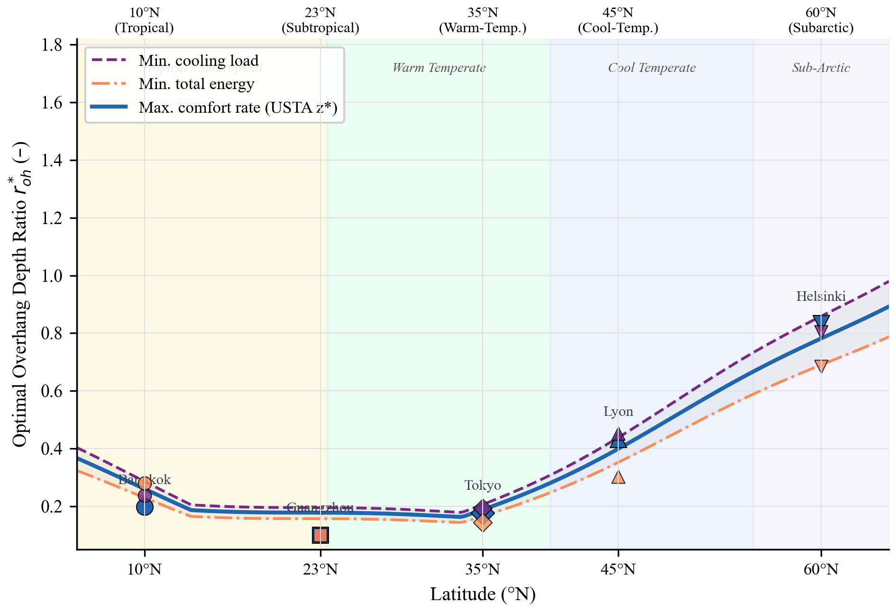
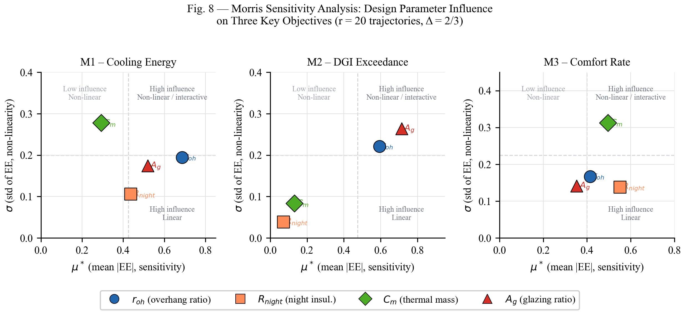

# 🌞 USTA: Unified Solar-Thermal-Adaptive Framework

<div align="center">

[](./main_twocolumn.pdf)
[](LICENSE)
[](https://www.python.org/)

**From Static Shading to Time-Domain Control: A Unified Framework for Climate-Adaptive Passive Building Design**

*Qingru Zhang | Beijing Normal University*

[📄 Paper](./main_twocolumn.pdf) • [📊 Figures](./figures/) • [🔧 Scripts](./scripts/) • [🌐 Website](https://kong-johnny.github.io/rush_jingshibei/)

</div>

---

## 🎯 What is USTA?

**USTA** is a physics-informed computational framework that revolutionizes passive solar building design by treating it as a **unified time-domain optimization problem**.

## 🏗️ Framework Architecture

<div align="center">

</div>

The framework consists of three integrated layers:
- **Layer 1**: Perez anisotropic sky model for time-resolved solar irradiance
- **Layer 2**: 3R2C reduced-order thermal network for transient dynamics
- **Layer 3**: Bi-level optimization (NSGA-II offline + MPC online)

## 🚀 Key Results

| Scenario | Metric | USTA | Baseline | Improvement |
|----------|--------|------|----------|-------------|
| Warm Climate | Cooling Load Proxy | ↓ 44.8% | - | ✅ Glare constraints met |
| Cold Climate | Heating Demand | ↓ 35.7% | - | ✅ 3× survivability |
| Dynamic Occupancy | Comfort Hours | 94.1% | 78.3% | +15.8 pp |
| Grid Outage | Hours ≥15°C | 45% | 18% | +27 pp |

## 📊 Results Overview

### Pareto Front (Multi-Objective Optimization)

<div align="center">

</div>

Five objectives optimized simultaneously: energy, comfort, glare, survivability, and actuation smoothness.

### Winter Temperature & Survivability

<div align="center">


</div>

Left: Winter indoor temperature trajectory. Right: 72-hour grid outage survivability.

### MPC Control Performance

<div align="center">

</div>

Model Predictive Control maintains 94.1% comfort hours under dynamic occupancy.

### Cross-Latitude Generalization

<div align="center">

</div>

Optimal shading strategies vary systematically with latitude: cooling-dominated (0-30°), transition (30-45°), heating-dominated (45°+).

### Sensitivity Analysis

<div align="center">

</div>

Morris screening identifies key design parameters: thermal mass, night insulation, and overhang ratio.

## 🔬 Ablation Study

| Remove Module | Impact | Magnitude |
|---------------|--------|-----------|
| Perez Model | Cooling ↓ | 4.7 pp decrease |
| 3R2C Dynamics | Comfort Violations | 3.25× increase |
| MPC Control | Comfort Violations | 5.6× increase |
| Pareto Search | Glare Violations | Systematic breach |

## 📁 Project Structure

```
latex_paper/
├── main_twocolumn.tex    # Main paper (Elsevier format)
├── main_twocolumn.pdf    # Compiled PDF
├── references.bib        # Bibliography
├── figures/              # Paper figures (PNG)
├── scripts/              # Python scripts for all figures
└── docs/                 # GitHub Pages website
```

## 🛠️ Quick Start

### Regenerate Figures

```bash
cd scripts
pip install matplotlib numpy scipy SALib
python fig1_framework.py
python fig2_pareto_front.py
# ... etc
```

### Compile Paper

```bash
pdflatex main_twocolumn.tex
bibtex main_twocolumn
pdflatex main_twocolumn.tex
pdflatex main_twocolumn.tex
```

## 👤 Author

**Qingru Zhang (张清茹)**
- 🎓 School of Artificial Intelligence, Beijing Normal University
- 📧 Email: trueshz@qq.com

**Advisor:** Prof. Guo Jianwei (郭建伟)

## 📜 License

MIT License - feel free to use and build upon!

---

<div align="center">

**⭐ Star this repo if you find it useful! ⭐**

Made with ❤️ and ☀️

[🌐 View Website](https://kong-johnny.github.io/rush_jingshibei/)

</div>