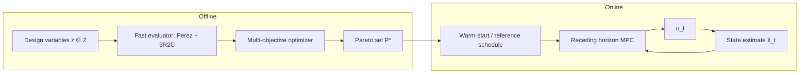

# USTA 统一太阳–热–自适应框架的计算机方法论写法：Problem Formulation 与 Proposed Method 深度研究报告

## 执行摘要

USTA（Unified Solar–Thermal–Adaptive）要写成“计算机方法论文”，关键不是把建筑案例写得更漂亮，而是把**被动式设计重写为时域的序列决策/最优控制问题**：明确集合、输入、状态、控制、约束与多目标代价，并给出可求解的离散化形式与算法管线，使审稿人能把它当作一个可复现、可扩展的计算框架来评估，而不仅是工程整合。fileciteturn0file0

本报告给出一套可直接用于论文 **Problem Formulation** 与 **Proposed Method** 的写作模板：  
1) 严格定义天气时序、几何、材料、占用预测等输入，以及 3R2C 状态、遮阳/百叶/夜间保温等控制；2) 基于 Perez 各向异性天空模型把天气映射到立面入射辐照，再耦合到 3R2C 热状态更新；3) 提出“离线多目标设计 + 在线 MPC 控制 + 层级混合求解”的算法贡献并给出伪代码与复杂度；4) 给出近似加速、鲁棒/随机不确定性处理、可复现参数清单与实验计划（基线、消融、指标与预期图表）。citeturn0search8turn1search1turn0search1turn0search10turn2search0turn2search5turn2search3

USTA 的“方法学新意”应被明确写成：**(i) 时域被动设计的形式化（time-domain passive design as sequential decision）**，**(ii) Perez–3R2C 的可计算耦合接口（radiation-to-state coupling）**，**(iii) Pareto 设计集对 MPC 的 warm-start 与分层求解（hierarchical solver pipeline）**，以及 **(iv) 跨气候/纬度的可迁移性结构（site-specific inputs vs universal mechanism）**。fileciteturn0file0

---

## 问题形式化

本节给出可直接落到论文里的数学定义。为保持“计算机方法论文”的严谨性，建议用**统一符号表 + 明确集合/维度**开篇，并把“设计变量”和“运行控制变量”分层。fileciteturn0file0

### 集合、时间离散与基本符号

- 离散时间集合：\(\mathcal{T}=\{0,1,\dots,T\}\)，时间步长 \(\Delta t\)（例如 15 min；你的初稿使用了 15 分钟步长与短时步预测控制设定，可在此对齐）。fileciteturn0file0  
- 立面/窗集合：\(\mathcal{F}\)（如 \(\{N,E,S,W\}\)）与窗 \(f\in\mathcal{F}\) 的几何参数（倾角 \(\beta_f\)、方位 \(\gamma_f\)、窗面积 \(A_f\)）。  
- 模型状态维度：对于单热区 3R2C，状态维数通常 \(n_x=2\)（室内空气节点与热质量节点）。低阶 RC 网络用于快速动态模拟与控制是常见做法与研究方向。citeturn0search3turn1search1

### 输入量定义（Inputs）

定义每个时刻的外生输入（可合并为向量）：
\[
\mathbf{w}_t \triangleq [T^{out}_t,\; \mathrm{DNI}_t,\; \mathrm{DHI}_t,\; \mathrm{GHI}_t,\; \mathbf{v}^{wind}_t,\; \rho^{sky}_t,\dots]
\]
其中 \(\mathrm{DNI},\mathrm{DHI},\mathrm{GHI}\) 是直射法向、散射水平与全球水平辐照。典型气象年 TMY3 数据是工程与研究中常用的气象输入形式，并在 NREL 手册中定义了获取与字段含义。citeturn2search3turn2search11

建筑与系统的静态参数（设计/建模输入）：
- 几何：\(\mathbf{g}\)（窗墙比、立面方位、遮阳构件的安装位置等）。  
- 材料与光热参数：\(\mathbf{m}\)（玻璃 SHGC、可见光透射率 VLT、反照率 \(\alpha_g\)、等效热阻/热容等）。  
- 运行扰动（占用/内得热预测）：\(\hat{\mathbf{o}}_{t:t+H-1}\)（预测占用人数、设备功率、照明等），并引入预测误差 \(\tilde{\mathbf{o}}_t\) 作为不确定性（后续用于鲁棒/随机 MPC）。MPC 在建筑控制中之所以重要，正是因为它可以显式处理预测、约束与多目标权衡。citeturn0search1turn0search9

### 状态变量（3R2C States）

采用单热区 3R2C（或等价二状态 RC 网络）：
\[
\mathbf{x}_t \triangleq 
\begin{bmatrix}
T^{in}_t\\
T^{m}_t
\end{bmatrix}
\]
- \(T^{in}_t\)：室内空气温度  
- \(T^{m}_t\)：等效热质量（墙/楼板等）温度  
RC 网络低阶模型以热阻/热容表示热区动态，是“可解释 + 可快速求解”的折中；其在城市尺度/控制导向模拟中的价值已被系统讨论。citeturn0search3turn4search17

### 控制变量（Design + Control）

USTA 需要把变量分成两层：

**设计层（离线一次性决策）**：\(\mathbf{z}\in\mathcal{Z}\)  
- 固定遮阳几何：如檐口深度比 \(r^{oh}_f=d^{oh}_f/h^{win}_f\)、竖向遮阳深度/间距、侧翼偏转角等。  
- 玻璃选择：\(\mathrm{SHGC}_f,\mathrm{VLT}_f\)（可离散为产品集合或连续近似）。  
- 热容改造：热质量倍率 \(k_C\)（等效 \(C_m\leftarrow k_C C_m\)）。  
- 夜间保温构件能力上限：最大附加热阻倍率 \(k_R^{max}\)。  
这些变量与你初稿中的“遮阳几何 + SHGC + 增加热容 + 夜间保温”一致，但在方法论文里必须明确为一个可行域 \(\mathcal{Z}\) 与约束集合。fileciteturn0file0

**运行层（在线时变控制）**：\(\mathbf{u}_t\in\mathcal{U}\)  
建议把在线控制写成向量：
\[
\mathbf{u}_t \triangleq [\theta^{lou}_t,\; s^{night}_t,\; P^{hvac}_t]^\top
\]
- \(\theta^{lou}_t\)：百叶角（连续，\([\theta_{min},\theta_{max}]\)）  
- \(s^{night}_t\)：夜间保温状态（0/1 或连续松弛 \([0,1]\)）  
- \(P^{hvac}_t\)：HVAC 功率/等效热流（若你的框架把 HVAC 当作“必要时的补偿”或完全停机生存性评估，可以在不同场景选择是否启用该维度）。  
建筑 MPC 文献通常采用“滚动时域 + 约束 + 多目标”形式，并强调模型与求解器选择对实时性的重要性。citeturn0search1turn2search25

### 约束（Constraints）

1) **热舒适约束**（硬约束或软约束）：
\[
T^{low}_t \le T^{in}_t \le T^{high}_t,\quad \forall t\in\mathcal{T}_{occ}
\]
若用软约束，引入松弛变量 \(\xi_t\ge 0\) 并在代价函数中惩罚。citeturn0search1turn2search25

2) **执行器约束**（幅值与速率）：
\[
\theta_{min}\le \theta^{lou}_t \le \theta_{max},\quad 
|\theta^{lou}_t-\theta^{lou}_{t-1}|\le \Delta\theta_{max}
\]
这类“平滑/限速”项是 MPC 在实际系统可用性的关键。citeturn0search1turn2search6

3) **夜间保温约束**：
\[
s^{night}_t \in \{0,1\} \;\text{(MIQP)} \quad \text{或}\quad s^{night}_t\in[0,1]\;\text{(convex relaxation)}
\]
混合整数会显著增加在线复杂度，因此后文给出松弛+舍入或分层策略。citeturn2search25turn4search0

4) **日照/眩光约束**（作为能见度与体验约束）  
眩光指标推荐使用 DGP（Daylight Glare Probability），其在日光环境的预测能力与标准化应用更常见；经典工作指出其优于一些旧指标并给出计算框架。citeturn3search1turn3search7  
若继续沿用 DGI（Daylight Glare Index），可引用“DGI≈22 作为可接受阈值”的综述来源。citeturn3search26turn3search0  

在方法论文中，你需要把“辐照/亮度模拟很复杂”的事实变成一个可计算的代理指标（proxy），并清楚说明其近似边界。citeturn3search1turn3search6

5) **韧性/生存性约束**（outage 场景）  
定义停电时间集合 \(\mathcal{T}_{out}\subseteq\mathcal{T}\)，在该集合内约束 \(P^{hvac}_t=0\)，并要求室温不低于安全阈值 \(T^{safe}\)：
\[
T^{in}_t \ge T^{safe},\quad t\in\mathcal{T}_{out}
\]
“热韧性/可居住时长”作为气候适应能力的一部分在近年综述中被系统讨论。citeturn1search3turn1search7

### 多目标代价函数（Multi-objective Cost）

定义目标向量 \(\mathbf{J}\)（用于 Pareto 优化）：
\[
\min_{\mathbf{z},\mathbf{u}_{0:T-1}}\;\mathbf{J}(\mathbf{z},\mathbf{u})=
\begin{bmatrix}
J_{energy}\\
J_{comfort}\\
J_{glare}\\
J_{surviv}\\
J_{act}
\end{bmatrix}
\]
一个严谨且可实现的写法如下（可按论文实际指标微调）：

1) 能耗/负荷目标：
\[
J_{energy}=\sum_{t\in\mathcal{T}} \left(c_{cool}\,[P^{hvac}_t]^+ + c_{heat}\,[-P^{hvac}_t]^+\right)\Delta t
\]
2) 舒适违约（软约束惩罚）：
\[
J_{comfort}=\sum_{t\in\mathcal{T}_{occ}}
\left(\max(0,T^{in}_t-T^{high}_t)^2+\max(0,T^{low}_t-T^{in}_t)^2\right)\Delta t
\]
3) 眩光惩罚（以 DGP 或 DGI 为准）：
\[
J_{glare}=\sum_{t\in\mathcal{T}_{occ}} \max(0,\mathrm{DGP}_t-\tau_{dgp})\Delta t
\]
4) 生存性（以“低于阈值的时长”最小化或“达标时长”最大化）：
\[
J_{surviv}=\sum_{t\in\mathcal{T}_{out}}\max(0,T^{safe}-T^{in}_t)\Delta t
\]
5) 执行器成本（避免抖振、鼓励平滑）：
\[
J_{act}=\sum_{t\in\mathcal{T}} \|\mathbf{u}_t-\mathbf{u}_{t-1}\|_2^2
\]
“多目标 + 约束”的框架可以用 NSGA-II 等 MOEA 直接在 \(\mathbf{J}\) 上做 Pareto 搜索，也可以在在线 MPC 中采用加权和标量化 \(J=\sum_i\lambda_i J_i\)（方便用 QP/凸优化求解）。NSGA-II 的经典论文给出了非支配排序与拥挤距离等机制，并讨论了其复杂度特性。citeturn0search10turn0search6

### 统一形式：序列决策/最优控制/双层优化

建议在论文里把 USTA 明确写成“设计–控制双层”的序列决策问题：

**外层（设计）**：求 Pareto 设计集
\[
\mathcal{P}^\star = \left\{\mathbf{z}\in\mathcal{Z}\;|\;\nexists \mathbf{z}' \text{ 使 } \mathbf{J}(\mathbf{z}',\pi^\star_{\mathbf{z}'}) \prec \mathbf{J}(\mathbf{z},\pi^\star_{\mathbf{z}})\right\}
\]
其中 \(\pi^\star_{\mathbf{z}}\) 表示给定设计 \(\mathbf{z}\) 时的最优运行策略（由 MPC/控制器产生）。

**内层（运行控制）**：滚动时域最优控制（MPC）
\[
\pi^\star_{\mathbf{z}}:\; \mathbf{x}_t \mapsto \mathbf{u}_t
\]
MPC 的标准写法是每个时刻解一个有限时域优化并实施第一步控制。建筑 MPC 的综述提供了统一的概念框架与实施工作流，可用于你“方法论文”中确立在线求解的合理性。citeturn0search1turn0search9

---

## 物理与计算耦合建模

USTA 的 Proposed Method 应当把“太阳辐射 → 立面入射 → 遮阳/百叶调制 → 室内得热 → 3R2C 状态更新”写成一个**可计算的离散时间模型**，并明确线性/非线性项来自哪里。Perez 模型用于倾斜面（包括垂直立面）的散射辐照转置是主流选择之一，并被多个工程实现（如 PVLIB/PVPMC）系统整理。citeturn0search8turn0search20turn0search24

### Perez 各向异性天空：从天气到立面入射辐照

对每个立面/窗 \(f\) 与时刻 \(t\)，计算太阳位置（天顶角 \(\theta_{z,t}\)、方位角 \(\gamma_{s,t}\)）与入射角 \(\theta_{i,f,t}\)。

将立面总入射辐照写成：
\[
E^{POA}_{f,t}=E^{beam}_{f,t}+E^{diff}_{f,t}+E^{grd}_{f,t}
\]

- 直射分量：
\[
E^{beam}_{f,t}=\mathrm{DNI}_t\cdot \max(0,\cos\theta_{i,f,t})
\]

- 散射分量（Perez 形式的一种常用表达；写论文时可注明你使用的具体 Perez1990 系数版本）：
\[
E^{diff}_{f,t}=\mathrm{DHI}_t\Big[
(1-F_{1,t})\frac{1+\cos\beta_f}{2} 
+ F_{1,t}\frac{\max(0,\cos\theta_{i,f,t})}{\max(\cos\theta_{z,t},\epsilon_0)}
+ F_{2,t}\sin\beta_f
\Big]
\]
其中 \(F_{1,t},F_{2,t}\) 是由天空清晰度等指标映射得到的经验系数，\(\epsilon_0\) 为避免除零的小常数（工程实现常取 0.087）。该形式在 Perez 1990 原始论文与 PV 领域的工程实现文档中均有对应描述。citeturn0search8turn0search20turn0search24

- 地面反射分量：
\[
E^{grd}_{f,t}=\rho_g\cdot \mathrm{GHI}_t\cdot \frac{1-\cos\beta_f}{2}
\]
其中 \(\rho_g\) 为地面反照率（可作为参数表公开）。citeturn0search20turn0search24

> 写作建议（方法论文口吻）：强调 Perez 模型对“短时步 + 各向异性散射 + 垂直面”场景的重要性，且其 discontinuity/分箱缺陷已被后续研究讨论——这为你引入“预计算/平滑近似”提供动机。citeturn0search8turn0search28

### 遮阳/百叶调制：从入射辐照到太阳得热与眩光代理

把遮阳与百叶抽象成一个**可微/可近似的透过函数**，用于耦合优化与控制：

\[
\tau_{f,t}(\mathbf{z},\mathbf{u}_t)=
\tau^{glass}_{f}(\mathbf{z})\cdot \tau^{shade}_{f,t}(\mathbf{z})\cdot \tau^{louver}_{f,t}(\theta^{lou}_t)
\]

太阳得热（进入热区的净热流）：
\[
Q^{sol}_{t}=\sum_{f\in\mathcal{F}} A_f\cdot E^{POA}_{f,t}\cdot \mathrm{SHGC}_f(\mathbf{z})\cdot \tau_{f,t}(\mathbf{z},\mathbf{u}_t)
\]

为了把太阳得热耦合进 3R2C，你通常需要一个“分配系数”把得热分到空气节点与热质量节点：
\[
Q^{sol,a}_t=\eta_a Q^{sol}_t,\quad Q^{sol,m}_t=\eta_m Q^{sol}_t,\quad \eta_a+\eta_m=1
\]
（例如：直射落在地面/墙体可提高 \(\eta_m\)，这与你初稿“把热质量当作 thermal battery”一致，但方法论文必须写成显式参数并在复现表中公开）。fileciteturn0file0

眩光代理：若不做全光线追踪（Radiance），建议使用 DGP 的简化形式或以垂直照度/窗面亮度代理来构造 \(\mathrm{DGP}_t\)。DGP 作为日光眩光指标的提出与验证来自经典论文与后续动态评估讨论。citeturn3search1turn3search7turn3search6

### 3R2C 连续模型推导与离散化

#### 连续时间状态空间（白盒/灰盒）

用热阻–热容网络写能量守恒。给出一个常用的 3R2C 写法（你可按自己的节点连接稍作变体，但要保持一致）：

设：
- \(C_a\)：室内空气等效热容  
- \(C_m\)：热质量等效热容  
- \(R_{oa}\)：室外到空气的等效热阻（含围护与渗透换气合并）  
- \(R_{am}\)：空气到热质量的耦合热阻  
- \(R_{om}\)：室外到热质量的等效热阻（如通过结构路径）  
夜间保温可通过时变热阻表示，例如 \(R_{oa}(t)=R_{oa}^{base}\cdot(1+k_R s^{night}_t)\)。

则：
\[
C_a\dot{T}^{in}=
\frac{T^{out}-T^{in}}{R_{oa}(t)}+
\frac{T^{m}-T^{in}}{R_{am}}+
Q^{int}_t + Q^{sol,a}_t + P^{hvac}_t
\]
\[
C_m\dot{T}^{m}=
\frac{T^{in}-T^{m}}{R_{am}}+
\frac{T^{out}-T^{m}}{R_{om}}+
Q^{sol,m}_t
\]

RC 低阶模型作为控制导向模型的优势（可解释、低计算代价）在多个综述与城市尺度模拟研究中被系统阐述；同时，已有工作也指出更简化的标准一阶模型（如按月验证的 ISO 简化模型）在动态精度与时间步适用性方面存在局限，这为你采用 2 状态/更高阶 RC 提供依据。citeturn0search3turn4search1turn4search33

将上述写成矩阵形式：
\[
\dot{\mathbf{x}}=A(\mathbf{z},s^{night})\mathbf{x}+B\mathbf{u}+E\mathbf{d}+ \mathbf{b}
\]
其中扰动 \(\mathbf{d}_t=[T^{out}_t,\;Q^{int}_t,\;Q^{sol}_t]^\top\)，而非线性主要来自 \(\tau_{f,t}(\cdot)\) 与 \(R_{oa}(t)\) 的时变/可能的整数开关。citeturn1search1turn0search1

#### 离散时间更新：Crank–Nicolson/精确离散

在方法论文中，建议把离散化写成“可复现实例”：  
\[
\mathbf{x}_{t+1}=A_d(\mathbf{z},s^{night}_t)\mathbf{x}_t+B_d\mathbf{u}_t+E_d\mathbf{d}_t+\mathbf{b}_d
\]

若使用 Crank–Nicolson（你初稿已采用该思路以提高稳定性，可在此“方法”里正式化）：fileciteturn0file0  
\[
\mathbf{x}_{t+1}=
\left(I-\frac{\Delta t}{2}A\right)^{-1}
\left(I+\frac{\Delta t}{2}A\right)\mathbf{x}_t
+\left(I-\frac{\Delta t}{2}A\right)^{-1}\Delta t\left(\frac{1}{2}(B\mathbf{u}_t+E\mathbf{d}_t+\mathbf{b})+\frac{1}{2}(B\mathbf{u}_{t+1}+E\mathbf{d}_{t+1}+\mathbf{b})\right)
\]
在实现中可用“当前步输入”近似代替 \(t+1\) 输入，从而得到标准的离散状态空间形式。citeturn2search25turn0search3

---

## 求解管线与算法实现

本节对应 Proposed Method 中最“计算机方法论文”的部分：你必须明确**算法贡献**与**求解结构**，并给出可复现的伪代码、流程图与复杂度。NSGA-II 的理论与实现细节可作为多目标设计的经典依据；MPC 综述与 MPC 教科书可支撑在线优化与复杂度表述。citeturn0search10turn0search1turn2search25

### USTA 的分层求解思想

建议把 USTA 明确写成一个三段式 pipeline：

1) **离线阶段：多目标设计空间搜索（Pareto）**  
输出 \(\mathcal{P}^\star=\{(\mathbf{z}^{(k)},\mathbf{J}^{(k)})\}_{k=1}^K\)，并选取 knee point 或按偏好选择设计。citeturn0search10turn4search10

2) **在线阶段：给定设计 \(\mathbf{z}\) 的滚动 MPC 百叶/夜间保温控制**  
每个时刻解一个有限时域优化，使用天气与占用预测。建筑 MPC 的实施工作流在综述中有清晰总结。citeturn0search1turn0search9

3) **耦合策略：用 Pareto 解 warm-start 在线 MPC（以及反向用在线表现修正离线模型/代理）**  
“warm-start + 因子分解缓存”可显著降低实时求解成本；OSQP 等 QP 求解器明确支持 warm-start 与缓存以适应参数化序列问题。citeturn2search2turn2search6

### 关键在线优化：MPC 子问题的标准写法（可直接写入论文）

在时刻 \(t\)，给定状态估计 \(\hat{\mathbf{x}}_t\)，解：
\[
\min_{\mathbf{u}_{t:t+H-1}} 
\sum_{k=0}^{H-1}
\left(
\|\mathbf{x}_{t+k|t}-\mathbf{x}^{ref}_{t+k}\|_{Q}^2
+\|\Delta \mathbf{u}_{t+k|t}\|_{R}^2
+\lambda_g\,\phi(\mathrm{DGP}_{t+k|t})
+\lambda_e\,\psi(P^{hvac}_{t+k|t})
\right)
\]
s.t.
\[
\mathbf{x}_{t+k+1|t}=f_d(\mathbf{x}_{t+k|t},\mathbf{u}_{t+k|t},\hat{\mathbf{d}}_{t+k|t};\mathbf{z})
\]
\[
\mathbf{u}_{min}\le \mathbf{u}_{t+k|t}\le \mathbf{u}_{max},\quad
\mathbf{x}_{min}\le \mathbf{x}_{t+k|t}\le \mathbf{x}_{max}
\]
并实施 \(\mathbf{u}_t=\mathbf{u}_{t|t}^\star\)。  
其中 \(f_d\) 是上一节给出的离散更新式，非线性来自遮阳透过率与夜间保温开关。MPC 的数值求解与工程实现细节可引用标准教材与综述。citeturn2search25turn0search1

### 伪代码（论文可直接使用）

**算法 1：USTA-Design-Control（分层多目标设计 + 在线 MPC）**

```text
Input: Weather series w_0:T, occupancy forecast model O(·), building geometry g,
       material bounds m, design domain Z, control domain U,
       time step Δt, MPC horizon H
Output: Pareto design set P*, selected design z*, closed-loop control log {u_t}

1:  // Offline multi-objective design (NSGA-II)
2:  Initialize population {z_i}_(i=1..Npop) ⊂ Z
3:  for gen = 1..G do
4:      for each individual z_i do
5:          Simulate USTA dynamics over T using:
6:              - Perez irradiance mapping to compute E_f,t^POA
7:              - Solar admission τ_f,t(z_i, u_t) with a nominal controller or short-horizon MPC
8:              - 3R2C discrete update x_{t+1}=f_d(x_t,u_t,d_t;z_i)
9:          Evaluate objectives J(z_i)=[J_energy,J_comfort,J_glare,J_surviv,J_act]
10:     end for
11:     Apply non-dominated sorting + crowding distance; generate offspring
12: end for
13: P* ← final non-dominated set; select z* via knee-point or preference vector

14: // Online control (receding-horizon MPC with warm-start)
15: Initialize x̂_0, u_-1
16: for t = 0..T-1 do
17:     Obtain forecasts ŵ_{t:t+H-1}, ô_{t:t+H-1}
18:     Warm-start MPC with previous solution and/or design-induced schedule
19:     Solve MPC to get u_{t|t}*,...,u_{t+H-1|t}*
20:     Apply u_t ← u_{t|t}*; update state x̂_{t+1} using measured/estimated data
21: end for
```

NSGA-II 的非支配排序与拥挤距离机制来自经典论文；其每代排序的复杂度讨论也可作为复杂度分析的引用依据。citeturn0search10turn0search6

### Mermaid 流程图（论文图草案）

```mermaid
flowchart TB
  A[Inputs: TMY weather w_t + occupancy forecast o_t + geometry g + materials m] --> B[Perez anisotropic sky transposition]
  B --> C[Façade POA irradiance E_f,t^POA]
  C --> D[Solar admission model τ_f,t(z,u_t): shade + louver + glass]
  D --> E[Heat gains Q_sol,a,t , Q_sol,m,t + glare proxy DGP_t]
  E --> F[3R2C discrete state update x_{t+1}=f_d(x_t,u_t,d_t;z)]
  F --> G{Offline or Online?}
  G -->|Offline| H[MO design optimizer (NSGA-II / MOEA/D) -> Pareto set P*]
  G -->|Online| I[MPC (QP/MIQP) with warm-start]
  H --> J[Select design z* + warm-start policy priors]
  J --> I
  I --> K[Control actions u_t]
  K --> F
```



### 复杂度与时延分析（Latency/Complexity）

**离线多目标阶段（NSGA-II）**  
- 每代非支配排序典型复杂度约为 \(O(MN_{pop}^2)\)（\(M\) 为目标数、\(N_{pop}\) 为种群规模），这是 NSGA-II 经典论文讨论的核心点之一。citeturn0search10turn0search6  
- 每个个体评估成本 \(\approx O(T\cdot(|\mathcal{F}|+n_x^3))\)：  
  - Perez 辐照映射对每个时刻与每个立面计算一次（可预计算加速）；citeturn0search20turn0search24  
  - 3R2C 状态更新为小维度线性代数（\(n_x=2\) 时几乎常数）。citeturn0search3turn1search1  

**在线 MPC 阶段**  
- 若将非线性（遮阳透过率、二值夜间保温）处理为凸近似/松弛，则 MPC 可落为 QP；QP 的实时求解可用一阶/算子分裂方法，通过矩阵分解缓存与 warm-start 显著降低重复求解成本，OSQP 论文明确讨论了这些特性与实时应用适配性。citeturn2search6turn2search2  
- 若保留二值变量（夜间保温开关）则为 MIQP，最坏情况呈指数复杂度；方法论文建议给出“在线松弛 + 规则化后处理”或“分层决策（先决定保温时段，再做连续 MPC）”以保证实时性。citeturn2search25turn4search0

---

## 近似加速与不确定性处理

“方法论文”应主动回答：为什么这个框架能在工程上跑得动？为什么面对不确定性仍可用？以下策略可以作为 Proposed Method 的“加速与鲁棒性”小节。citeturn1search1turn2search0turn2search5

### 近似与加速策略

**预计算与向量化（Radiation side）**  
- 对给定气候文件与立面集合，可预计算每个 \(t,f\) 的太阳几何项（\(\theta_{i,f,t}\)、\(\theta_{z,t}\)）与 Perez 系数 \(F_{1,t},F_{2,t}\)，把在线评估降为查表与少量乘加。Perez 模型在工程实现中常被封装成可复用函数（例如 pvlib/pvpmc 文档），适合做此类预计算。citeturn0search24turn0search20  
- 针对 Perez 1990 “分箱/不连续”问题，可采用平滑化近似或使用较新连续版本作为可选替代，并在论文中说明“我们仍以 Perez1990 为基准，但提供平滑近似以利于优化”。citeturn0search28turn0search8

**凸化与顺序凸规划（Optimization side）**  
- 将 \(\tau^{louver}(\theta)\) 用分段线性/二次函数近似，使得代价与约束可写成 QP（或 SOCP），便于实时求解。凸优化的数值效率与建模思想可引用 Boyd & Vandenberghe。citeturn4search0turn4search12  
- 对非凸项采用 Sequential Convex Programming（SCP）：在当前轨迹线性化并迭代更新；在 MPC 数值优化教材中可找到“数值最优控制/实时迭代”的标准叙事。citeturn2search25

**代理模型（Surrogate-assisted MO）**  
- 离线多目标搜索最耗时的是大量个体的年度仿真。可用代理模型近似 \(\mathbf{z}\mapsto \mathbf{J}\)：  
  - 高斯过程/随机森林（样本数少时）；  
  - 物理约束神经网络（PINN/physics-informed 或 physically consistent NN）以提升长预测步精度与数据效率。控制导向 PINN 在建筑热建模中已有明确方法与实验论证，可作为你“代理加速”的参考来源。citeturn3search2turn3search28  
- 写作上要强调：代理只用于**加速搜索**，最终 Pareto 解需用物理模型复核（避免方法学被质疑为“黑箱”）。citeturn1search1turn4search17

**warm-start 体系**  
- 在线 MPC：用上一时刻解 warm-start；  
- 设计–控制耦合：从 Pareto 设计集中提取“日程参考曲线”（如典型日百叶角/夜间保温时段）作为 MPC 初始解或参考轨迹；  
- 求解器层面：使用支持 warm-start 与分解缓存的 QP 求解器（如 OSQP）。citeturn2search6turn2search2

### 不确定性建模与鲁棒/随机 MPC

USTA 的关键扰动来自：天气预测误差、占用预测误差、模型参数误差（RC 参数、遮阳透过率近似误差）。在“计算机方法论文”中建议把不确定性写成一个统一形式：

\[
\mathbf{d}_t = \hat{\mathbf{d}}_t + \mathbf{e}_t,\quad \mathbf{e}_t \in \mathcal{E}\ \text{或}\ \mathbf{e}_t \sim \mathcal{D}
\]

- **鲁棒 MPC（bounded disturbances）**：假设 \(\mathbf{e}_t\in\mathcal{E}\)（有界集合），通过鲁棒约束保证最坏情况下温度仍满足约束。Mayne 等关于有界扰动鲁棒 MPC 的经典论文可用于方法论引用。citeturn2search5turn2search21  
- **随机 MPC / 机会约束（chance constraints）**：将舒适约束写成概率形式 \( \mathbb{P}(T^{in}_t \le T^{high}) \ge 1-\alpha\)，在 Mesbah 的综述中，机会约束与 SMPC 的核心思想被系统阐释，适合用来支撑你“占用随机性”的方法选择。citeturn2search0turn2search12  

> 写作落点：强调 USTA 的“自适应”不仅是百叶会动，而是**对不确定性有可证明的约束处理方式**（最坏保证或概率保证），这是偏计算机/控制期刊审稿人非常看重的“方法学硬度”。citeturn2search0turn2search5

---

## 可复现实验设置与评测计划

方法论文必须把“别人能否复现”当作硬指标。本节提供你应在论文里公开的参数清单与实验矩阵（含基线与消融表模板）。TMY3 数据来源与格式可引用 NREL 手册；MPC 与求解器选择可引用综述与 OSQP。citeturn2search3turn0search1turn2search6

### 可复现参数清单（建议放在 Appendix 或 Reproducibility Checklist）

**时间与数据**  
- \(\Delta t\)：15 min（与你初稿一致）；总仿真长度：典型年 \(T=365\times 24\times 4\)。fileciteturn0file0  
- 天气数据：TMY3（地点、站点 ID、字段：DNI/DHI/GHI/干球温度/风速等）；数据获取说明按 NREL TMY3 手册。citeturn2search3turn2search11  
- 占用：预测模型（如：日程 + 事件冲击 + 噪声）；误差分布设定（用于 SMPC/RMPC）。

**Perez 辐射模型**  
- 采用的 Perez 版本（1990 all-weather transposition）；天空清晰度参数计算方式；\(\epsilon_0\) 等数值稳定常数；地面反照率 \(\rho_g\)。citeturn0search8turn0search20turn0search24  

**3R2C 模型**  
- \(R_{oa},R_{am},R_{om},C_a,C_m\) 数值与单位；  
- 夜间保温：\(k_R^{max}\)、启停逻辑/可行时段；  
- 太阳得热分配：\(\eta_a,\eta_m\)；  
- 离散化：Crank–Nicolson（或精确离散）与数值实现细节。citeturn0search3turn1search1turn4search17  

**多目标优化（NSGA-II / 可选替代）**  
- 目标维数 \(M=5\)（energy/comfort/glare/survivability/actuator）；  
- NSGA-II：种群 \(N_{pop}\)、代数 \(G\)、交叉概率 \(p_c\)、变异概率 \(p_m\)、拥挤距离参数、是否使用约束支配；  
- 终止条件：最大代数或超体积（HV）提升 < \(\epsilon\) 连续 \(k\) 代；  
- 替代算法：MOEA/D（分解式多目标）可作为对照。citeturn0search10turn4search10  

**在线 MPC**  
- 预测步长 \(H\)：例如 4h（按 15min 为 16 步；你初稿也采用 4 小时预测窗）；fileciteturn0file0  
- 权重矩阵 \(Q,R\)，眩光权重 \(\lambda_g\)，能耗权重 \(\lambda_e\)，生存性/安全权重 \(\lambda_s\)；  
- 求解器：QP 用 OSQP（容差、最大迭代、warm-start 开关、线性系统分解缓存策略）；非凸/混合整数策略（松弛/舍入或 MIQP 求解器）。citeturn2search6turn2search22turn2search25  

### 基线方法（Baselines）设计

为体现“USTA 的方法学优势覆盖其它方法不足”，基线建议覆盖三条断裂链：**辐射建模、热动态建模、控制/优化策略**。

1) **静态遮阳几何基线**：solar-noon 或关键日（至日/分）几何定尺 + 各向同性天空（isotropic diffuse）。其不足在于对各向异性散射与全天时序不敏感；USTA 的 Perez 时域建模用于覆盖该不足。citeturn0search8turn0search20  
2) **简化热模型基线**：稳态 R-value 或标准一阶简化模型（按月验证/粒度有限），对热惰性与相位滞后刻画不足；USTA 的 3R2C/低阶动态网络覆盖。citeturn4search1turn4search33turn1search0  
3) **反应式控制基线**：规则控制/阈值开关百叶（reactive）；USTA 的 MPC 覆盖预测性与约束处理能力不足。citeturn0search1turn2search25  
4) **单目标/加权和优化基线**：固定权重标量化或网格搜索；USTA 的 Pareto 搜索覆盖其对非凸 Pareto 前沿与权衡解释不足。citeturn0search10turn4search10  

### 消融实验（Ablation）矩阵

消融要围绕“USTA 真正新增的方法学组件”：

- 去 Perez：Perez → isotropic diffuse（检验各向异性散射贡献）citeturn0search8turn0search20  
- 去热质量：\(C_m\downarrow\) 或 \(\eta_m=0\)（检验 thermal battery 贡献）citeturn1search0turn0search3  
- 去 MPC：MPC → reactive（检验预测控制贡献）citeturn0search1  
- 去 warm-start：禁用 warm-start/缓存（检验实时性与收敛速度贡献）citeturn2search6  
- 去鲁棒/随机：RMPC/SMPC → nominal MPC（检验不确定性处理贡献）citeturn2search0turn2search5  
- 去 surrogate：MOEA+surrogate → 纯物理评估（检验离线加速贡献；可结合 PINN/PCNN 文献作为 surrogate 选型依据）citeturn3search2turn3search28  

### 指标（Metrics）与预期输出（Tables/Figures）

建议至少包括以下可审稿的“硬指标”：
- 能耗：年冷/热能耗（或度时 proxy）、峰值负荷  
- 舒适：违约时长、违约积分（degree-hours）  
- 眩光：\(\mathrm{DGP}\) 超阈值时长/积分（或 DGI 超阈值）citeturn3search1turn3search26  
- 生存性：停电期间 \(T^{in}\ge T^{safe}\) 的时长/比例（thermal resilience）citeturn1search3  
- 计算：离线评估总时间、在线每步 MPC latency（P50/P95）、迭代次数、失败率  

预期图表：
1) Pareto 前沿（2D/3D 投影）  
2) 时间序列对比（室温、百叶角、入射辐照、眩光指标）  
3) 消融条形图（每个模块贡献）  
4) latency 分布箱线图（在线实时性）  

### 实验对比表模板（算法、基线、消融）

**表 1：算法变体对比（建议在 Proposed Method/Experiments 中使用）**

| 方法/变体 | 离线优化 | 在线控制 | 不确定性 | 加速策略 | 输出 | 备注 |
|---|---|---|---|---|---|---|
| USTA-Full | NSGA-II | MPC(QP/MIQP) | RMPC/SMPC | warm-start + surrogate | Pareto + closed-loop | 主方法 |
| USTA-Nominal | NSGA-II | MPC | 无 | warm-start | 同上 | 不确定性消融 |
| USTA-NoWarmStart | NSGA-II | MPC | 同上 | 无 | 同上 | latency 消融 |
| USTA-MOEA/D | MOEA/D | MPC | 同上 | 同上 | 同上 | 离线优化替代 |

**表 2：基线对比表（Baseline）**

| 类别 | 基线名称 | 辐射模型 | 热模型 | 控制策略 | 预期劣势（你要在结果中证明） |
|---|---|---|---|---|---|
| 静态遮阳 | Solar-noon sizing | isotropic | 任意 | 无/规则 | 不捕捉时域与各向异性散射 |
| 简化热 | Steady-state / ISO-like | 任意 | 一阶/稳态 | 任意 | 不捕捉热惰性与相位滞后 |
| 反应控制 | Rule-based louver | 任意 | 3R2C | reactive | 无预测、约束处理弱 |
| 单目标优化 | Weighted-sum | 任意 | 任意 | 任意 | 易错过非凸 Pareto、可解释性差 |

**表 3：消融矩阵（Ablation Matrix）**

| 实验编号 | Perez | 3R2C | MPC | warm-start | RMPC/SMPC | surrogate | 预期观察 |
|---|---|---|---|---|---|---|---|
| A0 (Full) | ✓ | ✓ | ✓ | ✓ | ✓ | ✓ | 最优能耗-舒适-眩光-韧性权衡 |
| A1 | ✗ | ✓ | ✓ | ✓ | ✓ | ✓ | 眩光/冷负荷相关指标恶化 |
| A2 | ✓ | ✗ | ✓ | ✓ | ✓ | ✓ | 热韧性显著下降、夜间波动增大 |
| A3 | ✓ | ✓ | ✗ | ✓ | ✓ | ✓ | 峰值超温与舒适违约增加 |
| A4 | ✓ | ✓ | ✓ | ✗ | ✓ | ✓ | 在线延迟、收敛迭代显著增加 |
| A5 | ✓ | ✓ | ✓ | ✓ | ✗ | ✓ | 不确定情景下约束违约率上升 |
| A6 | ✓ | ✓ | ✓ | ✓ | ✓ | ✗ | 离线搜索成本大幅上升 |

---

## 方法学创新点与引用

### 创新点应如何“显式写进论文”

为了让 USTA 真正像“计算机方法论文”，建议在 Problem Formulation 与 Proposed Method 中用明确小段落写出以下四条创新，并与前述基线不足一一对齐：

1) **时域被动设计形式化（Time-domain passive design formulation）**  
把遮阳/采光/热惰性从“静态几何选型”提升为**离散时间序列决策问题**：\(\min_{\mathbf{z},\mathbf{u}_{0:T-1}}\mathbf{J}\) s.t. \(\mathbf{x}_{t+1}=f_d(\cdot)\)。这使 USTA 能自然表达相位滞后、预测性控制与停电生存性指标（而传统静态遮阳与稳态热分析难以统一表述）。fileciteturn0file0

2) **Perez–3R2C 的耦合接口（Radiation-to-state coupling strategy）**  
明确给出 \( \mathbf{w}_t \xrightarrow{\text{Perez}} E^{POA}_{f,t} \xrightarrow{\tau(\mathbf{z},\mathbf{u})} Q^{sol}_t \xrightarrow{\text{3R2C}} \mathbf{x}_{t+1}\) 的可计算链条。Perez 模型与 3R2C/RC 网络都有扎实文献基础，但创新点在于**把它们做成可优化/可控制的统一离散系统**，并进一步服务多目标与在线求解。citeturn0search8turn0search3turn1search1

3) **分层求解器管线（Hybrid hierarchical solver pipeline）**  
离线用 MOEA（NSGA-II）得到可解释的 Pareto 设计集，在线用 MPC 做运行期自适应控制，并利用 Pareto 解 warm-start 在线优化以保证实时性。NSGA-II 与 MPC 各自成熟，但“**Pareto→warm-start→MPC**”的系统化耦合与复杂度/时延论证，应被写成你论文的算法贡献之一。citeturn0search10turn0search1turn2search6

4) **跨气候可迁移结构（Transferability structure & proof sketch）**  
给出一个“可迁移性分解”的论证框架：  
- **地点相关**：输入 \(\mathbf{w}_t\)、日程 \(\hat{\mathbf{o}}_t\)、立面方位 \(\gamma_f\)；  
- **地点不变**：模型结构（Perez 转置 + 3R2C 状态 + 控制/优化器）。  
然后用实验计划在不同纬度/气候/占用模式下验证“同一结构 + 不同输入”仍能稳定产生 Pareto 与闭环性能。热韧性指标的研究背景可引用相关综述。citeturn1search3turn1search7

### 参考文献优先列表（短、精选、可支撑上述写法）

以下给出“优先级高、可直接支撑 Problem Formulation/Method”且与你前文草稿尽量一致的来源清单（按建议引用顺序）。括号内为你论文中的编号格式示例 [1],[2]…；每条后附可核验链接引用。  

- [1] Perez 各向异性天空/倾斜面辐照转置：Perez 1990（Solar Energy 44(5) 271–289）。citeturn0search8turn0search20turn0search24  
- [2] 低阶热网络（RC）动态建模：Lauster 2014（Building and Environment）。citeturn0search3turn4search1  
- [3] RC 模型综述（城市/快速仿真）：Yang 2024（Energy and Buildings 323, 114765）。citeturn1search1turn1search9  
- [4] 热惰性综述：Verbeke & Audenaert 2018（RSER 82）。citeturn1search0turn1search12  
- [5] 建筑 MPC 综述：Drgoňa et al. 2020（Annual Reviews in Control 50）。citeturn0search1turn0search9turn0search17  
- [6] MPC 数值求解与设计：Rawlings & Mayne《Model Predictive Control: Theory, Computation, and Design》（第 2 版 PDF）。citeturn2search25  
- [7] NSGA-II 原始论文：Deb et al. 2002（IEEE TEVC）。citeturn0search10turn0search6  
- [8] MOEA/D（可作为离线优化对照）：Zhang & Li 2007（IEEE TEVC）。citeturn4search10turn4search22  
- [9] 随机 MPC/机会约束综述：Mesbah 2016（Stochastic MPC Overview）。citeturn2search0turn2search12  
- [10] 鲁棒 MPC（有界扰动）：Mayne et al. 2005（Automatica）。citeturn2search5turn2search21  
- [11] QP 实时求解与 warm-start：OSQP（Stellato et al.）。citeturn2search6turn2search2  
- [12] TMY3 数据定义与获取：Wilcox & Marion（NREL TMY3 User’s Manual）。citeturn2search3turn2search11  
- [13] 日光眩光指标 DGP：Wienold & Christoffersen 2006（Energy and Buildings）。citeturn3search1turn3search23  
- [14] DGI 阈值与视觉舒适指标综述（用于支撑 DGI≈22）：Carlucci 等综述。citeturn3search26  
- [15] 控制导向的物理约束代理模型（PINN/PCNN，用于加速与替代模型讨论）：Gokhale 2022（Applied Energy 314, 118852）与 Di Natale 2022（Applied Energy）。citeturn3search2turn3search28  
- [16] 热韧性背景：Hong et al. 2023（Building and Environment）。citeturn1search3turn1search7